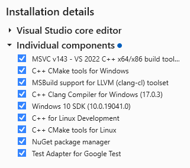

# Windows Environment Setup

Even if you do not intend to use Visual Studio as your IDE of choice, it is the only officially supported way of downloading the various Windows SDKs to build the C++ project.

Download the latest community edition from [here](https://visualstudio.microsoft.com/vs/).  At the time of writing this is Visual Studio 2022.

You will require the `Desktop development with C++` workload.  This can be selected during the installation, or after via the `Visual Studio Installer` program and modifying the Visual Studio Installation.

We recommend getting the rest of the project's dependencies via a package manager, and for that we use Scoop. Follow the steps on the bottom of the homepage [here](https://scoop.sh/) to get it installed.

```sh
scoop install git llvm nasm python task ninja cmake@3.28.3
```

Here is the English translation:

---

## Visual Studio Packages

- **MSVC v143 — VS 2022 C++ x64/x86 build tools** — this is critical. Without it, you won't have the Windows SDK, `kernel32.lib`, or `user32.lib`. This is the component that provides the paths in `%LIB%`.

- **MSBuild support for LLVM (clang-cl) toolset** — keep it. This is MSBuild support for the clang-cl toolset. If you ever want to build via MSBuild (not through CMake), this will be useful. And without it, VS may not recognize clang-cl as a compiler.

- **C++ Clang Compiler for Windows (17.0.3)** — this is the clang bundled with VS, not your Scoop llvm. You can uncheck it if you already have llvm from Scoop (you do — `C:\Users\valery\scoop\apps\llvm\current`). But you can also keep it — VS will use its own clang, while the Scoop CMake will use its own. There won't be a conflict, since they are in different paths. I recommend unchecking it to avoid confusion with two clangs.

- **Windows 10 SDK (10.0.19041.0)** — keep it.

- **C++ CMake tools for Windows** —  keep it.



---

## Building in Command Line

Use `x64 Native Tools Command Prompt` for building

```bash
cd /d D:\projects\hww\_c\soot.git
rmdir /s /q out
cmake --preset Debug-windows-clang
cmake --build out/build/Debug
```
